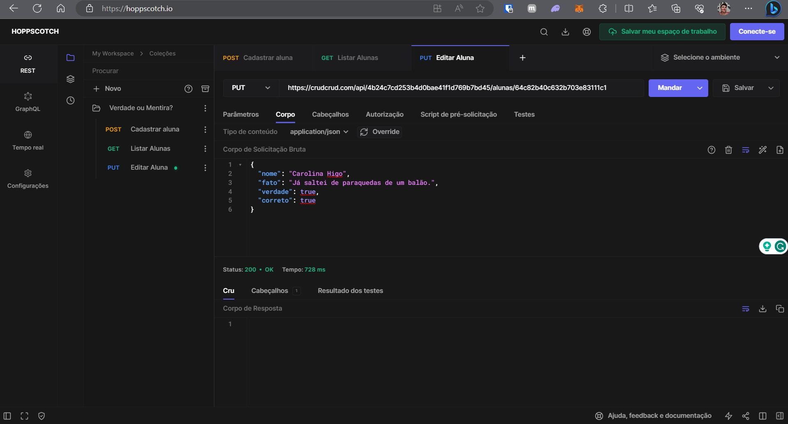

# Roteiro de Aula

## **Introdução** [15 min]

- **Breve apresentação da professora [5 min]:** contar um pouco da minha história e jornada até o momento, trazer alguns fatos curiosos e engraçados.

- **Apresentação do plano de aula [10 min]:** fazer um breve resumo sobre os pontos que iremos ver hoje na aula, explicando que todo o conteúdo será apresentado de forma dinâmica, com a mão na massa.

 

## **Dinâmica para revisão de conteúdo** [45 min]

Faremos uma revisão em grupo sobre o que é, como funciona e para que serve uma API. A ideia é ser uma roda de conversa, com a participação das alunas. Perguntarei sobre os temas e incentivarei a turma a responder as perguntas e avaliarem se concordam com as respostas, conduzindo o grupo para o conceito final.

Iremos juntas visitar um site pelo navegador, abrir o console de inspeção de rede e identificar quais requisições são para APIs.

 

## **Intervalo** [10 min]

 

## **Dinâmica dos verbos** [120 min]

Iremos fazer uma dinâmica prática de **CRUD** em uma API para consolidar os verbos já aprendidos **GET** e **POST** e aprender sobre os novos verbos **PUT** e **DELETE**.

A dinâmica será uma brincadeira de descobrir se um fato sobre cada uma das alunas é verdade ou mentira.

 

### **Preparando a brincadeira** [30 min]

1. Irei acessar o site [CrudCrud](https://crudcrud.com/) para criar a API temporária que usaremos na dinâmica, mostrando para as alunas este excelente recurso para estudos.

   

 

2. Iremos juntas - cada uma em sua máquina - acessar a ferramenta online [Hoppscotch](https://hoppscotch.io/) pelo navegador. Usaremos como uma alternativa ao Postman, que elas já conhecem, para ampliar conhecimento sobre diferentes que podem ser utilizadas para o mesmo propósito.

   - Criaremos um novo projeto chamado **Verdade ou mentira?**

     

 

### **Revisão POST / GET** [30 min]

**POST [15 min]** Iremos nos cadastrar na API com as seguintes informações:

- `nome`: cadastrar uma string com o próprio nome
- `fato`: cadastrar uma string com um fato sobre si mesma, que pode ser uma verdade ou uma mentira
- `verdade`: cadastrar o valor `null` para inicializar a propriedade

- Iremos salvar a `requisição` como **Cadastrar aluna** dentro do projeto que criamos anteriormente.

- **O resultado final deverá ser parecido com este:**

  

  Analisar junto a resposta da requisição, como status code, corpo e cabeçalho

 

**GET [15 min]** Assim que todas as alunas conseguirem se cadastrar na API, iremos fazer a leitura da lista de alunas cadastradas.

- Iremos salvar a `requisição` como **Listar alunas** dentro do projeto que criamos anteriormente.

- **O resultado final deverá ser parecido com este:**

  

  Analisar junto a resposta da requisição, como status code, corpo e cabeçalho

 

### **Aprendendo PUT E DELETE** [60 min]

Nesta parte da aula, iremos passar pela lista de alunas recuperada anteriormente, iremos olhar os itens na ordem apresentada:

- A aluna dona do item irá ler a propriedade `fato` em voz alta

- Faremos uma votação com a turma se achamos que o fato é verdade ou mentira. Iremos utilizar o recurso de lavantar a mão do Zoom - a maioria vence.

- A aluna dona do item deverá guardar qual foi a resposta da turma.

**Breve explicação sobre PUT:** [5 min]

- Utilizado para modificar um item específico

- Modifica o item inteiro

 

**Praticando para entender** [25 min]

Cada aluna irá criar uma nova requisição para praticarmos o **PUT**. Irei demonstrar com o meu item da lista.

- Encontrar o item com o próprio nome e copiar o valor da propriedade `_id`

- Criar um request do tipo `PUT`, mostrar que o valor do `_id` deve ser incluido no recurso de rota para indicar qual item deverá ser alterado

- Adicionar um corpo do tipo `application/json`

- Incluir o mesmo objeto usado inicialmente no `POST`

- Alterar o valor da propriedade `verdade` para `true` se o fato for verdade ou `false` se o fato for mentira

- Incluir uma nova propriedade `correto` e inserir o valor `true`, caso a sala tenha acertado a resposta ou `false`, caso a sala tenha errado a resposta. _Esta etapa serve para reforçar o conceito de que este método altera o objeto original por completo_.

- Salvar a `requisição` como **Editar aluna** dentro do projeto que criamos anteriormente

- **O resultado final deverá ser parecido com este:**

  

  Analisar junto a resposta da requisição, como status code, corpo e cabeçalho

 

**Breve explicação sobre DELETE** [5 min]

- Utilizado para remover um item específico

 

**Praticando para entender** [10 min]

Cada aluna irá criar uma nova requisição para praticarmos o **DELETE**. Irei demonstrar com o meu item da lista.

- Encontrar o item com o próprio nome e copiar o valor da propriedade `_id`

- Criar um request do tipo `DELETE`, mostrar que o valor do `_id` deve ser incluido no recurso de rota para indicar qual item deverá ser removido - **NÃO EXECUTAR A REQUESIÇÃO**

- Salvar a `requisição` como **Remover aluna** dentro do projeto que criamos anteriormente

- **O resultado final deverá ser parecido com este:**

  

  Analisar junto a resposta da requisição, como status code, corpo e cabeçalho

 

**Continuando com a última parte da dinâmica** [15 min]

Iremos voltar para a aba onde listamos a lista para olharmos juntas para a lista com as novas informações.

- A aluna dona do item irá falar sobre o seu fato, se é verdade ou mentira e iremos identificar pelas propriedades `verdade` e `correto` se a turma acertou

- Caso a turma tenha acertado, este item deverá ser removido da lista, portanto a própria aluna dona do item irá executar a requisição que acabamos de criar

- Após a execução da remoção, iremos executar a recuperação da lista completa para identificarmos que o item não está mais lá

Após passaramos por todos os itens, iremos descontrair com os itens que restaram, pois serão fatos inusitados, verdades que foram consideradas mentira pela turma.

Por fim, as alunas donas dos itens "vencedores" também irão executar a requisição de remoção. Encerraremos a aula com a lista completamente vazia.

 

## **Encerramento** [20 minutos]

Deixar um tempo final para comentários, dúvidas, conversa.
